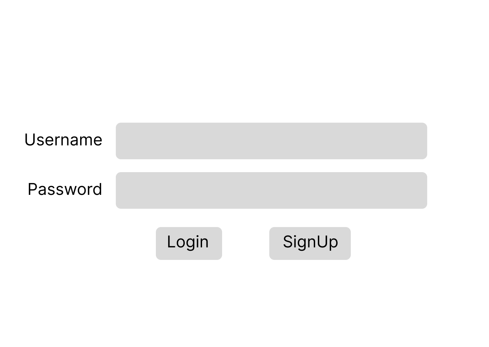
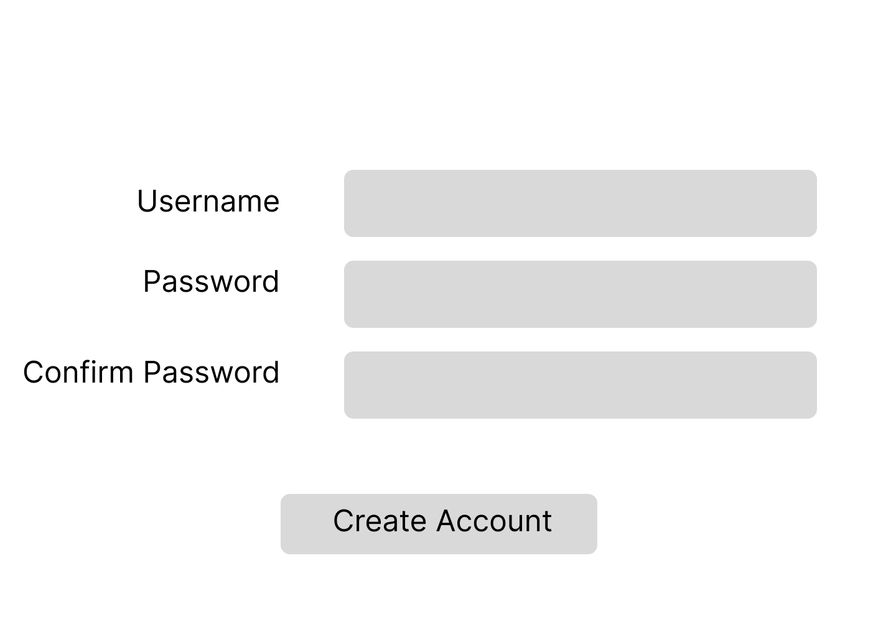

#Module 1 Group Assignment

CSCI 5117, Fall 2026, [assignment description](https://canvas.umn.edu/courses/579310/pages/project-1)

## App Info:

* Team Name: Peter Parkers
* App Name: Missions (tentative name)
* App Link: [https://developing-the-interactive-web-project-1-q87a.onrender.com/]

### Students

* Jeonghyo Kim, kim02607
* Kelvin Pang, pang0161
* Salman Hussein, husse347
* Xuan Gu, ehrma055
* Donald Huynh, huynh338

## Key Features

**Describe the most challenging features you implemented
(one sentence per bullet, maximum 4 bullets):**

* ...

## Testing Notes

**Is there anything special we need to know in order to effectively test your app? (optional):**

* ...

## Screenshots of Site

**[Add a screenshot of each key page (around 4)](https://stackoverflow.com/questions/10189356/how-to-add-screenshot-to-readmes-in-github-repository)
along with a very brief caption:**

## Mock-up 

There are a few tools for mock-ups. Paper prototypes (low-tech, but effective and cheap), Digital picture edition software (gimp / photoshop / etc.), or dedicated tools like moqups.com (I'm calling out moqups here in particular since it seems to strike the best balance between "easy-to-use" and "wants your money" -- the free teir isn't perfect, but it should be sufficient for our needs with a little "creative layout" to get around the page-limit)

In this space please either provide images (around 4) showing your prototypes, OR, a link to an online hosted mock-up tool like moqups.com

* Link: [https://www.figma.com/design/luParcBqdCh4ywY9Jmwp9h/Test-Project?node-id=0-1&m=dev&t=DNVU6SZXRvBktKUJ-1]

**[Add images/photos that show your paper prototype (around 4)](https://stackoverflow.com/questions/10189356/how-to-add-screenshot-to-readmes-in-github-repository) along with a very brief caption:**

  
We used figma to make a mock-up of our user engagement focused microblogging website.

## External Dependencies

**Document integrations with 3rd Party code or services here.
Please do not document required libraries. or libraries that are mentioned in the product requirements**

* Library or service name: description of use
* ...

**If there's anything else you would like to disclose about how your project
relied on external code, expertise, or anything else, please disclose that
here:**

...
