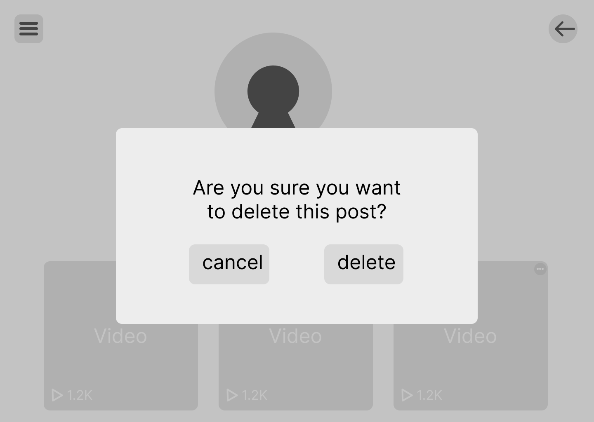

#Module 1 Group Assignment

CSCI 5117, Fall 2026, [assignment description](https://canvas.umn.edu/courses/579310/pages/project-1)

## App Info:

* Team Name: Peter Parkers
* App Name: Missions (tentative name)
* App Link: [https://developing-the-interactive-web-project-1-q87a.onrender.com/]

### Students

* Jeonghyo Kim, kim02607
* Kelvin Pang, pang0161
* Salman Hussein, husse347
* Xuan Gu, ehrma055
* Donald Huynh, huynh338

## Key Features

**Describe the most challenging features you implemented
(one sentence per bullet, maximum 4 bullets):**

* ...

## Testing Notes

**Is there anything special we need to know in order to effectively test your app? (optional):**

* ...

## Screenshots of Site

**[Add a screenshot of each key page (around 4)](https://stackoverflow.com/questions/10189356/how-to-add-screenshot-to-readmes-in-github-repository)
along with a very brief caption:**

## Mock-up 

* Link: [https://www.figma.com/design/luParcBqdCh4ywY9Jmwp9h/Test-Project?node-id=0-1&m=dev&t=DNVU6SZXRvBktKUJ-1]

<!-- **[Add images/photos that show your paper prototype (around 4)](https://stackoverflow.com/questions/10189356/how-to-add-screenshot-to-readmes-in-github-repository) along with a very brief caption:** -->

<!--  -->
### Log-in/Sign-up
We used figma to make a mock-up of our mission based, user engagement focused microblogging website.  
The first two images of our mock-up show simple log-in/sign-up pages

### The Initial Page
When a user first logs in, they can view a limited number of posts. To view more posts, they must create their own post. Until they do, the remaining posts are hidden, with a message prompting them to post to unlock more content.

### Homepage
Once past that, we see a typical feed. We want a mechanism for people to be able to engage and self-moderate. Think, reporting system + popular posts survive per category (maybe?).

Here's a view of the expanded hamburger bar.

On clicking the meatball menu, we're given a few options for a post.

A look of the comment section.

Barebones upload page.

### Profile Pages

On clicking any of your videos' meatball menu, you can edit, delete, or share. (for now...)

No options meatball menue for other users, clicking a video should bring you back to a view of a video, similar to the default homepage view.

Here's a mission page that shows the stats of a user, this is still under consideration so we might not go with a mission tracking page.

## External Dependencies

**Document integrations with 3rd Party code or services here.
Please do not document required libraries. or libraries that are mentioned in the product requirements**

* Library or service name: description of use
* ...

**If there's anything else you would like to disclose about how your project
relied on external code, expertise, or anything else, please disclose that
here:**

...
